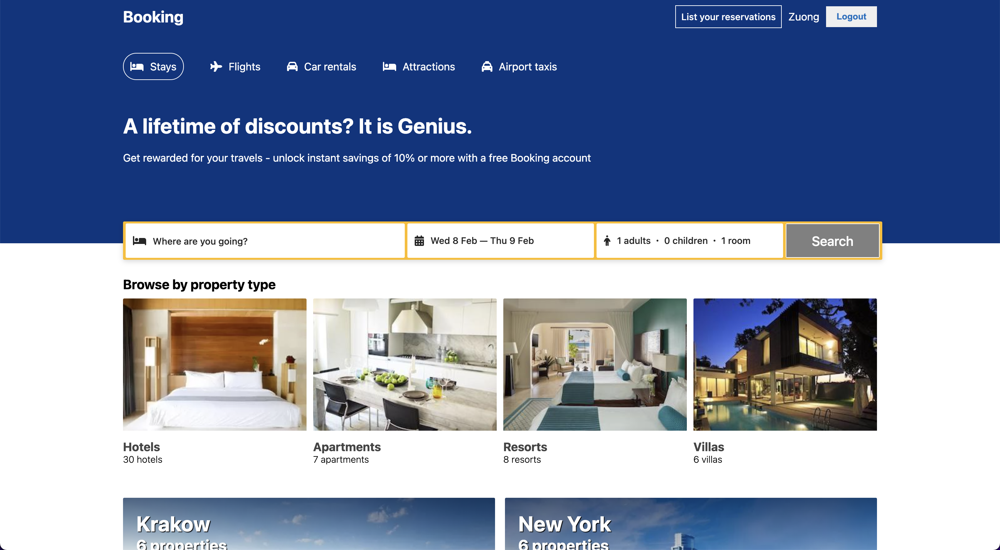

<!-- PROJECT LOGO -->
 

  

<h3 align="center">Booking App Front End</h3>

  

    The front-end part of the Booking app (Clone from <b>https://booking.com</b> project)
     
    <a href="https://github.com/dylan751/booking-app-front-end"><strong>Explore the docs »</strong></a>
     
     
    <a href="https://github.com/dylan751/booking-app-front-end">View Repo</a>
    ·
    <a href="https://github.com/dylan751/booking-app-front-end/issues">Report Bug</a>
    ·
    <a href="https://github.com/dylan751/booking-app-front-end/issues">Request Feature</a>
  

<!-- TABLE OF CONTENTS -->

  
Table of Contents

  <ol>
    <li>
      <a href="#about-the-project">About The Project</a>
      <ul>
        <li><a href="#built-with">Built With</a></li>
      </ul>
    </li>
    <li>
      <a href="#getting-started">Getting Started</a>
      <ul>
        <li><a href="#prerequisites">Prerequisites</a></li>
        <li><a href="#installation">Installation</a></li>
      </ul>
    </li>
    <li><a href="#usage">Usage</a></li>
    <li><a href="#roadmap">Roadmap</a></li>
    <li><a href="#contributing">Contributing</a></li>
    <li><a href="#contact">Contact</a></li>
    <li><a href="#acknowledgments">Acknowledgments</a></li>
  </ol>

<!-- ABOUT THE PROJECT -->

## About The Project

(<a href="#readme-top">Back to top</a>)

